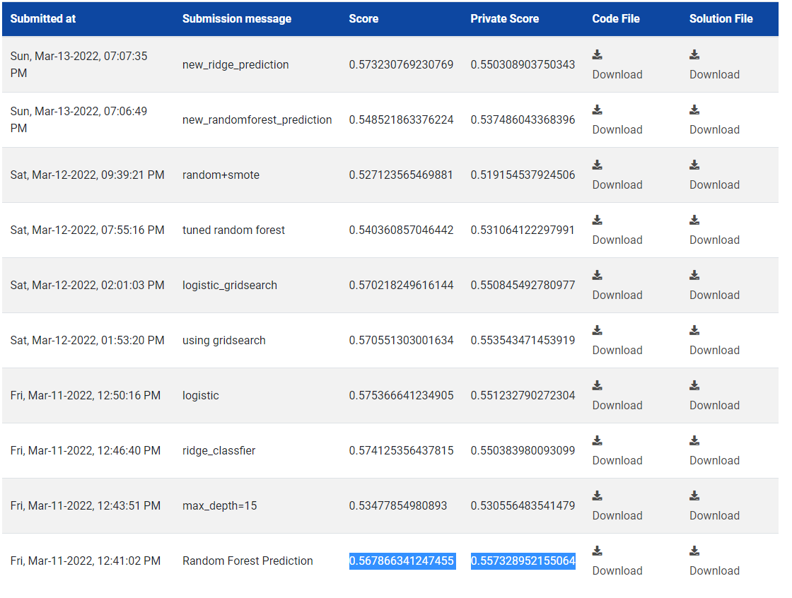

# Analytics_Vidhya_Hackathon
This repository contains the code and approach used in the hackathon

# Problem Statement
Customer Churn Prediction
# Approach
- Data preprocessing
- Feature Engineering
- Model Building
- Model Evaluation
# Data Preprocessing
- There were total 11 columns and 6650 rows.
- The features were:
- ID: Unique Identifier of a row
- Age: Age of the customer
- Gender: Gender of the customer (Male and Female)
- Income: Yearly income of the customer
- Balance: Average quarterly balance of the customer
- Vintage: No. of years the customer is associated with bank
- Transaction_Status: Whether the customer has done any transaction in the past 3 months or not
- Product_Holdings: No. of product holdings with the bank
- Credit_Card: Whether the customer has a credit card or not
- Credit_Category: Category of a customer based on the credit score
- Is_Churn: Whether the customer will churn in next 6 months or not **(Target Variable)**

- **Age Column**: My approach was first to check the range of values that age takes and according to that convert it to groups so that it can be better visualized. So, age was ranging between 21-72, so i grouped it as 21-31, 31-41...etc. After plotting the bar plot for age column i saw that age 30-60 are more in numbers and using pivot_table with target variable, i found out as the age was increasing the churn rate was also increasing. so i thought age is a good feature to keep as it was clearly showing some pattern for churn rate. 
-   But after looking others approach i see that the age is highly correlated to target column and need some transformation. And to check multicollinearity, Vif can be used. 
- **Gender**: What i visualize is that female are less in number than man in the dataset but female are more churning than man. So, i kept this variable.
- **Income**: Income is a categorical variable and it had 4 type, less than 5L, 5-10L,10-15L, greater than 15L. Using pivot table i saw that less than 10L income, people are less churning and greater than 10L people i more churning. So i created two new categories as less than 10L and greater than 10L and replaced all according to respective category.
- **Balance**: I just scaled the Balance column and nothing more.
-    But watching others approach i got to know that there were outliers in this column and treatment was required. (I am stupid)
- **Vintage**: Using pivot table with churn column i saw vintage is not able to distinguish or show any pattern for churn rate according to the category but i saw it was showing some pattern with transaction_status, so i kept this variable.
- **Transaction_Status**: This is a categorical variable. And it clearly shows that a person that has not done any transaction in past three months are more likely to churn. So, I kept this variable.
- **Product_Holdings**: This feature didn't showed any relation with target variable, hence i didn't used this in model building.
- **Credit Card**: This feature told that the churning is not due to whether the person has credit card or not. Hence didn't used the feature for modle building.
- **Credit Category**: This variable has thre category, average,poor and good. And as expected, credit_card with poor rating has more churning rate than others. So, kept this variable for the model.
- **Is_Churn**: This is the target variable. It has only two values means binary classification. But this variable is imbalanced and hence did resampling with oversampling method.

# Model_Building
- **Logistic Regression:** It gave f1-score as 0.570218249616144 on public dataset and	0.550845492780977 on private dataset.
- **RidgeRegressor Classifier**: It gave f1-score of 0.573 on public dataset and 0.55 on private dataset.
- **Random Forest**: It gave f1-score of 0.567866341247455 on public dataset and 0.557328952155064 on private dataset.
# These are my scores for various submissions:

# Rank: 180.
# Learning:
- It was a good experience to participate and i got to know where i am lacking.
